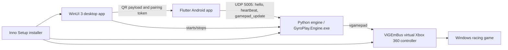

# GyroPlay

GyroPlay is an open-source mobile-to-PC game controller for racing games. The Android app turns phone tilt and touch controls into UDP controller packets, the Windows engine maps those packets to a virtual Xbox 360 controller, and the WinUI desktop app provides pairing, engine control, and installer-friendly setup.

Version: `0.1.0`

## Key Features

- Android controller app with landscape steering-wheel style tilt input.
- Calibration, invert steering, smoothing, dead zone, max tilt, and sensitivity settings.
- Touch throttle and brake pedals.
- Press-and-release controls for gear up, gear down, and handbrake.
- UDP pairing with QR codes, short-lived tokens, sessions, and heartbeats.
- Python/vgamepad engine packaged as `GyroPlay.Engine.exe`.
- WinUI 3 desktop control panel for QR pairing and engine start/stop.
- Inno Setup installer for Windows with ViGEmBus and firewall setup.

## Architecture



## Screenshots

Place release screenshots in `docs/screenshots/` when they are ready:

- `docs/screenshots/mobile-controller.png` - Android controller screen.
- `docs/screenshots/desktop-control-panel.png` - Windows desktop control panel.
- `docs/screenshots/installer.png` - Windows installer flow.

## Android Setup

1. Install Flutter and Android Studio.
2. Connect an Android device or start an emulator.
3. From the repo root:

```powershell
cd mobile\flutter_app
flutter pub get
flutter run
```

For a release APK:

```powershell
cd mobile\flutter_app
flutter build apk --release --target-platform android-arm64
```

The APK is created at `mobile/flutter_app/build/app/outputs/flutter-apk/app-release.apk`.

## Windows Setup

For normal users, install `GyroPlaySetup.exe` from a release. The installer installs the WinUI desktop app, bundles `GyroPlay.Engine.exe`, installs ViGEmBus if needed, and adds the inbound UDP firewall rule for port `5005`.

For development:

1. Install Visual Studio with WinUI/Windows App SDK workloads.
2. Install Python 3.11 or newer.
3. Install Inno Setup 6 if building the installer.
4. Create the engine virtual environment:

```powershell
cd engine\python
python -m venv .venv
.\.venv\Scripts\python.exe -m pip install --upgrade pip
.\.venv\Scripts\python.exe -m pip install -r requirements.txt
.\.venv\Scripts\python.exe -m pip install -r requirements-dev.txt
```

5. Build the engine executable:

```powershell
cd engine\python
.\build-engine.ps1
```

6. Run or publish the WinUI desktop app from `desktop/winui_app/GyroPlay.Desktop`.

## Usage

1. Start the Windows desktop app.
2. Click `Start Engine`.
3. Open the Android app.
4. Scan the QR code shown by the desktop app, or enter the PC IPv4 address manually.
5. Wait for the mobile app to show `Connected`.
6. Tap `Calibrate` while holding the phone in its neutral landscape steering position.
7. Start the game and bind the virtual Xbox 360 controller in the game's input settings.

## Build Installer

The Windows installer build is driven by `installer/build-installer.ps1`.

```powershell
.\installer\build-installer.ps1
```

Expected output:

- `installer/output/GyroPlaySetup.exe`

The installer build requires `installer/dependencies/ViGEmBus_1.22.0_x64_x86_arm64.exe`.

## Development Layout

- `mobile/flutter_app/` - Flutter Android controller.
- `engine/python/` - UDP engine and virtual gamepad bridge.
- `desktop/winui_app/GyroPlay.Desktop/` - WinUI 3 desktop control panel.
- `protocol/` - UDP protocol documentation and sample packets.
- `installer/` - Inno Setup installer and build script.
- `docs/` - project documentation.

## Release Builds

The release workflow is `.github/workflows/release.yml`.

- Manual runs build artifacts only.
- Tags matching `v*` build artifacts and attach them to a GitHub Release.
- The Android and Windows builds run as separate jobs.
- SHA256 checksum files are generated for the APK and installer.

## Known Limitations

- Windows PC support only for the engine and desktop app.
- Android is the only mobile target currently supported.
- UDP traffic is local-network oriented and is not encrypted.
- One active paired phone/session is supported at a time.
- ViGEmBus is required for virtual Xbox controller support.
- No desktop profiles, installer auto-update, QR discovery hardening, or cloud features yet.
- Firewall and router isolation can prevent mobile-to-PC UDP traffic.

## Troubleshooting and Contributing

- Troubleshooting: `docs/troubleshooting.md`
- Contributing: `CONTRIBUTING.md`
- Protocol: `protocol/protocol.md`

## License

A root `LICENSE` file is required before the first public release. Until that file is added, the project should be treated as not yet licensed for redistribution.
