<div align="center">
  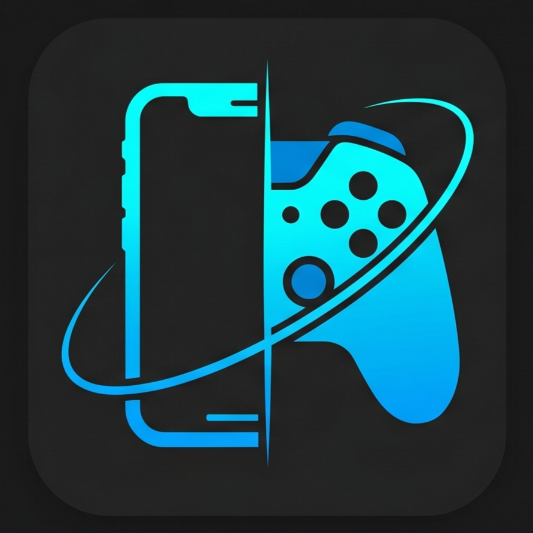

  # GyroPlay

  **Turn your phone into a motion-powered PC game controller.**

  GyroPlay is an open-source Android-to-Windows virtual game controller. It lets you control PC games using phone gyroscope steering and touch controls for throttle, brake, gears, handbrake, and other racing actions.

  [Download latest release](https://github.com/saiusesgithub/GyroPlay/releases) · [View setup guide](docs/setup.md) · [Report an issue](https://github.com/saiusesgithub/GyroPlay/issues)

  [](https://github.com/saiusesgithub/GyroPlay/releases)
  [](LICENSE)
  [](#supported-platforms)
  [](#supported-platforms)
  [](mobile/flutter_app)
  [](desktop/winui_app/GyroPlay.Desktop)
  [](#license)
  [](https://github.com/saiusesgithub/GyroPlay/actions/workflows/build-android-apk.yml)
  [](https://github.com/saiusesgithub/GyroPlay/actions/workflows/release.yml)
</div>

## Demo

A short video/GIF demo will be added after launch. For now, the screenshots below show the pairing flow, controller screen, desktop dashboard, diagnostics, and installer.

<!-- Future demo asset paths:
- assets/demo/gyroplay-demo.gif
- assets/demo/gyroplay-demo-video-thumbnail.png
- assets/pc/gyroplay-assetto-corsa-gameplay.png
-->

## Main Features

- **Gyroscope steering** - use your phone in landscape orientation like a steering wheel.
- **Touch throttle and brake** - large touch pedals designed for glanceable gameplay.
- **Gear controls and handbrake** - press-and-release controls for gear up, gear down, and handbrake.
- **QR pairing** - scan a desktop-generated QR code to connect without typing IP addresses.
- **Local-network communication** - UDP packets over your LAN or phone hotspot, with no account or cloud dependency.
- **Controller calibration** - set the current phone position as neutral before driving.
- **Sensitivity and dead-zone settings** - tune steering dead zone, max tilt angle, smoothing, sensitivity, and inversion.
- **Saved controller profiles** - start with the built-in Assetto Corsa profile and keep settings locally.
- **Windows desktop control panel** - manage pairing, engine status, local IP, logs, diagnostics, and setup state.
- **Driver and firewall diagnostics** - detect ViGEmBus and the inbound UDP firewall rule.
- **Repair setup support** - repair the driver and firewall rule from the desktop app or installer.
- **Tray and auto-start integration** - keep the engine available without keeping the main window open.
- **Open-source and ad-free** - no ads, accounts, telemetry service, or cloud backend.

## Screenshots

### Android App

| Home | Pair Device | Controller |
| --- | --- | --- |
| 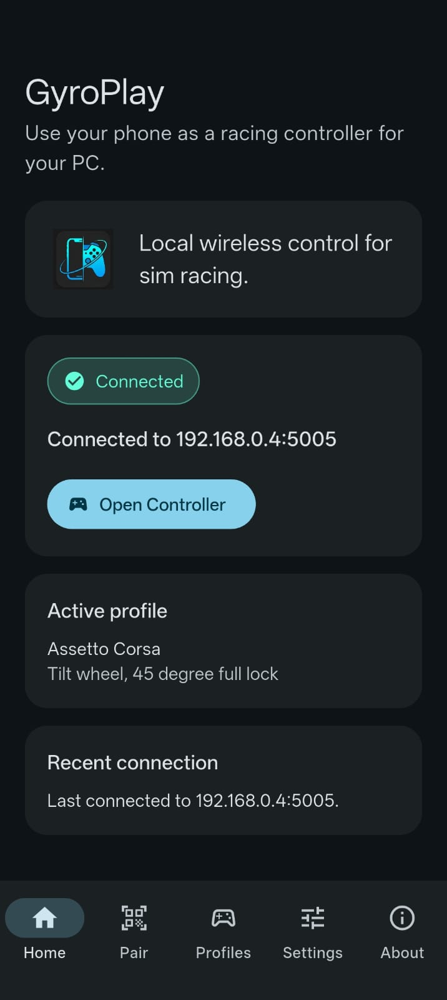 | 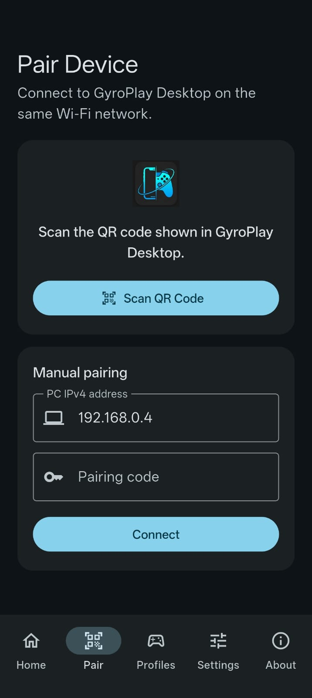 | 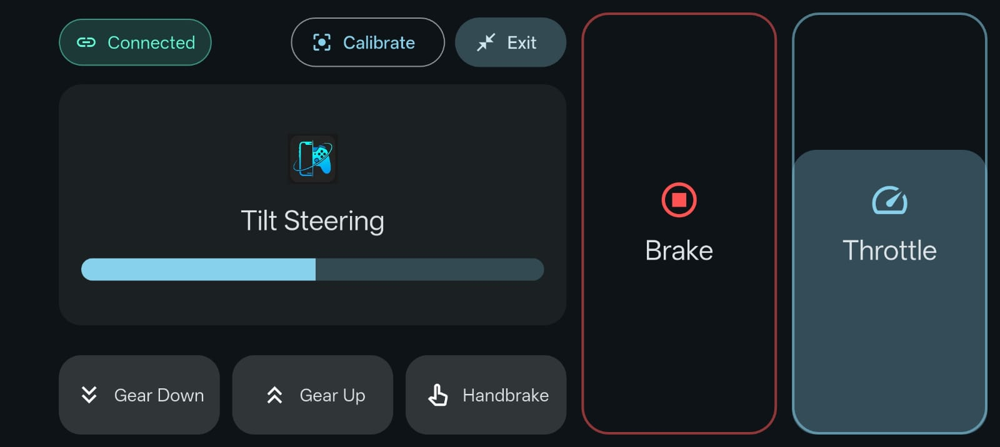 |

| Profiles | Settings | Calibration |
| --- | --- | --- |
| 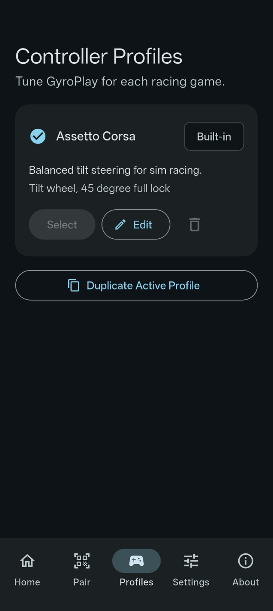 | 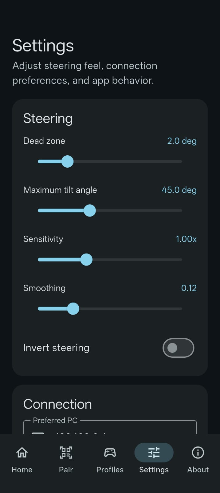 | 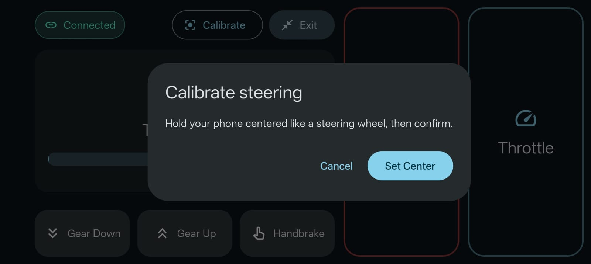 |

### Windows Desktop

| Home | Diagnostics |
| --- | --- |
| 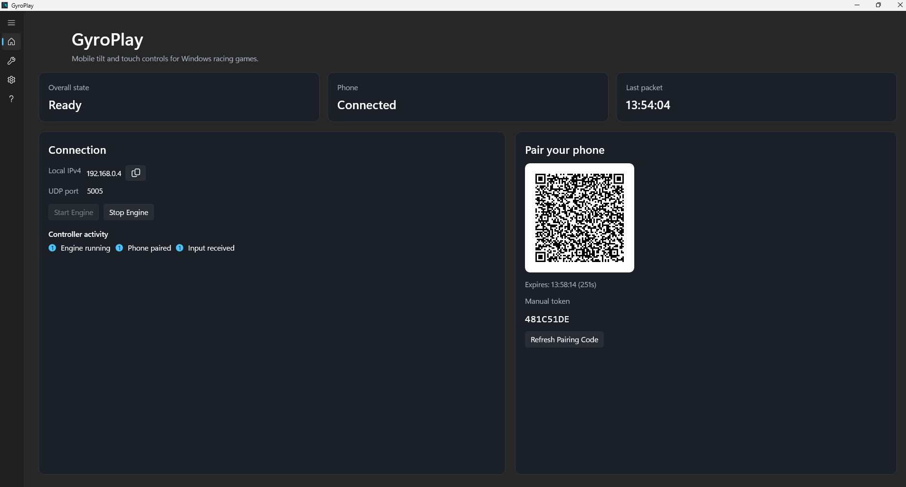 | 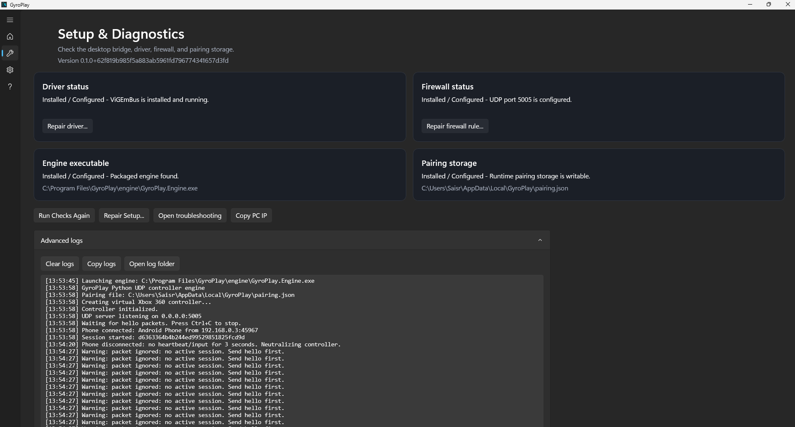 |

| Settings and Tray | Installer |
| --- | --- |
| 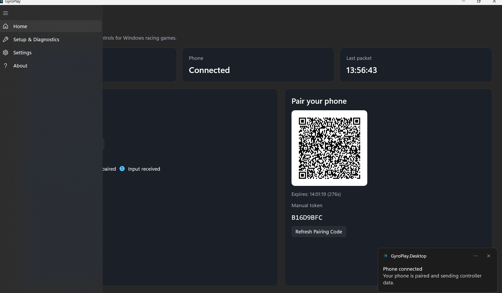 | 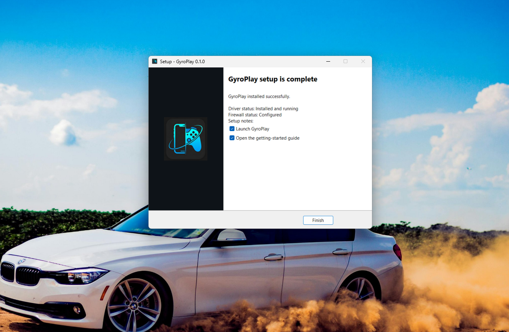 |

## How It Works

The Android app pairs with the Windows desktop app, sends controller updates to the local UDP engine, and the engine maps those values to a virtual Xbox 360 controller.

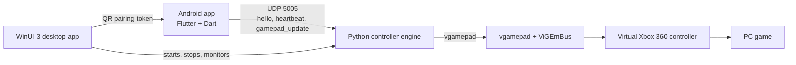

## Installation

### Android

1. Open the [latest GitHub Release](https://github.com/saiusesgithub/GyroPlay/releases).
2. Download the ARM64 Android APK.
3. Allow installation from unknown sources if Android prompts you.
4. Install GyroPlay.
5. Keep the phone and PC on the same Wi-Fi network, or connect both through the phone hotspot.

The current APK is ARM64-only.

### Windows

1. Open the [latest GitHub Release](https://github.com/saiusesgithub/GyroPlay/releases).
2. Download `GyroPlaySetup.exe`.
3. Run the installer and approve the administrator prompt.
4. Allow setup to install or repair ViGEmBus and configure the UDP 5005 firewall rule.
5. Launch GyroPlay Desktop.
6. Click **Start Engine**.
7. Scan the QR code from the Android app.

End users do not need Python, Flutter, Visual Studio, or the .NET SDK.

## Quick Start

1. Install GyroPlay Desktop on Windows.
2. Install the GyroPlay Android APK.
3. Open GyroPlay Desktop.
4. Click **Start Engine**.
5. Open the Android app and scan the QR code.
6. Tap **Open Controller**.
7. Calibrate while holding the phone centered.
8. Launch Assetto Corsa or another PC game.
9. Map the virtual Xbox controller in the game if required.

## Supported Platforms

| Component | Supported |
| --- | --- |
| Android app | Android ARM64 |
| Windows desktop app | Windows 10/11 x64 |
| Virtual controller | ViGEmBus-backed Xbox 360 controller |

Not supported yet:

- iOS
- Linux or macOS desktop
- USB controller mode
- Universal game compatibility without manual input mapping

## Architecture

The repository is split into focused components:

- `mobile/flutter_app/` - Flutter Android app, QR pairing, sensor steering, touch controls, local settings.
- `desktop/winui_app/GyroPlay.Desktop/` - WinUI 3 desktop control panel, pairing QR, engine process management, diagnostics, tray integration.
- `engine/python/` - UDP server and virtual Xbox controller mapping through `vgamepad`.
- `protocol/` - UDP packet formats and sample payloads.
- `installer/` - Inno Setup installer and release packaging support.
- `docs/` - setup, troubleshooting, architecture, and contributor documentation.

For more detail, see [docs/architecture.md](docs/architecture.md).

## Configuration

GyroPlay stores controller settings locally on the phone.

- **Dead zone** - ignores small movement around center to reduce drift.
- **Max tilt angle** - sets how much phone rotation equals full steering.
- **Sensitivity** - scales steering response after the dead zone.
- **Smoothing** - reduces shake from small sensor noise.
- **Invert steering** - flips left/right input if your phone orientation is reversed.
- **Calibration** - sets the current phone angle as neutral.
- **Profiles** - save steering preferences for different games; v0.1.0 includes an Assetto Corsa profile.

## Troubleshooting

Start with [docs/troubleshooting.md](docs/troubleshooting.md).

Common checks:

- Phone and PC must be on the same local network.
- Windows Firewall must allow inbound UDP port `5005`.
- ViGEmBus must be installed and available.
- The virtual controller should appear in `joy.cpl`.
- Refresh the QR code if the pairing token expired.

## Known Limitations

- GyroPlay depends on ViGEmBus, which is retired upstream.
- Desktop support is Windows-only.
- The current APK build is Android ARM64-only.
- Local-network latency depends on Wi-Fi or hotspot quality.
- Touch controls do not provide physical feedback.
- Some games require manual controller remapping.
- No USB mode yet.
- No customizable controller layout yet.
- UDP traffic is local-network oriented and not encrypted.
- One active phone session is supported at a time.

## Development Setup

Prerequisites:

- Flutter SDK and Android Studio for mobile development.
- .NET SDK and Windows App SDK tooling for the WinUI desktop app.
- Python virtual environment for the engine.
- Inno Setup 6 for local Windows installer builds.

Common commands:

```powershell
cd mobile\flutter_app
flutter pub get
flutter analyze
flutter build apk --release --target-platform android-arm64
```

```powershell
dotnet build desktop\winui_app\GyroPlay.Desktop\GyroPlay.Desktop.csproj -c Release -p:Platform=x64
```

```powershell
cd engine\python
.\build-engine.ps1
```

```powershell
.\installer\build-installer.ps1
```

See [CONTRIBUTING.md](CONTRIBUTING.md) for contribution workflow and testing expectations.

## Contributing

Contributions are welcome. Please keep changes focused, document behavior changes, and include the checks you ran.

- [Contributing guide](CONTRIBUTING.md)
- [Issues](https://github.com/saiusesgithub/GyroPlay/issues)
- [Protocol docs](protocol/protocol.md)

## License

GyroPlay is licensed under the GNU General Public License v3.0. See [LICENSE](LICENSE) for the full license text.

## Acknowledgements

GyroPlay uses Flutter, Dart, WinUI 3, C#, Python, `vgamepad`, ViGEmBus, QRCoder, Inno Setup, and GitHub Actions.
