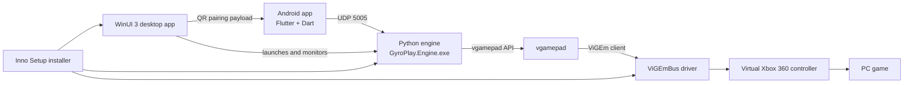
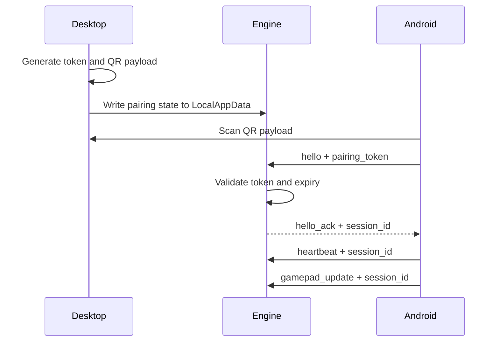
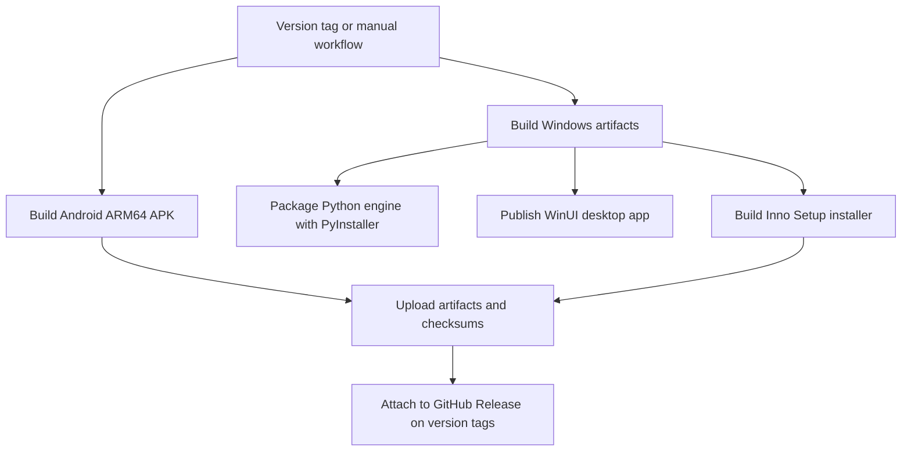

# GyroPlay Architecture

GyroPlay is a local-network controller bridge. The Android app captures motion and touch input, sends UDP packets to the PC, and the Windows engine maps those packets to a virtual Xbox 360 controller.

## System Components

## Mobile App Responsibilities

Location: `mobile/flutter_app/`

- Pair with the desktop app using QR or manual IP entry.
- Maintain HELLO / HELLO_ACK session state.
- Send heartbeat packets.
- Convert phone tilt into steering.
- Apply calibration, dead zone, sensitivity, smoothing, and inversion.
- Send touch controls for throttle, brake, gears, and handbrake.
- Store controller settings and profiles locally.

## Desktop App Responsibilities

Location: `desktop/winui_app/GyroPlay.Desktop/`

- Display the local IPv4 address and UDP port.
- Generate QR pairing payloads.
- Start and stop the packaged engine.
- Monitor engine stdout events.
- Show phone connection status and last packet time.
- Diagnose ViGEmBus and firewall status.
- Provide repair actions for setup issues.
- Store runtime pairing state and logs under LocalAppData.
- Provide tray, auto-start, and notification integrations.

## Python Engine Responsibilities

Location: `engine/python/`

- Listen on UDP port `5005`.
- Validate pairing tokens and sessions.
- Accept controller packets only for the active session.
- Apply safety timeout behavior.
- Map controller packet fields to `vgamepad`.
- Emit machine-readable events for the desktop app.
- Reset all virtual controller inputs on timeout or shutdown.

## UDP Protocol Overview

Location: `protocol/`

The protocol uses local UDP JSON packets.

Important packet types:

- `hello` - sent by Android to begin pairing.
- `hello_ack` - sent by engine with a session ID.
- `heartbeat` - sent by Android every second.
- `gamepad_update` - sent by Android at gameplay rate.

Sessions are short-lived. Controller updates without a valid `session_id` are rejected.

## Pairing and Session Flow

## Controller Output Mapping

| GyroPlay input | Virtual Xbox output |
| --- | --- |
| `left_x` | Left joystick X-axis |
| `throttle` | Right trigger |
| `brake` | Left trigger |
| `gear_up` | Xbox A |
| `gear_down` | Xbox X |
| `handbrake` | Xbox B |

The left joystick Y-axis is kept centered.

## Build and Release Flow

## Security and Privacy Model

- GyroPlay uses local-network UDP.
- No account is required.
- No cloud backend is used.
- Pairing tokens are short-lived.
- UDP traffic is not encrypted.
- Users should not expose UDP port `5005` to the public internet.
- Logs should be shared with pairing tokens removed.

## Runtime Data Paths

Windows desktop runtime data:

- Settings: `%LOCALAPPDATA%\GyroPlay\settings.json`
- Pairing state: `%LOCALAPPDATA%\GyroPlay\pairing.json`
- Logs: `%LOCALAPPDATA%\GyroPlay\Logs`

Installed application files:

- App: standard Windows Program Files install directory.
- Engine: `engine\GyroPlay.Engine.exe` under the installed GyroPlay app directory.

Android settings are stored using Flutter `shared_preferences`.
